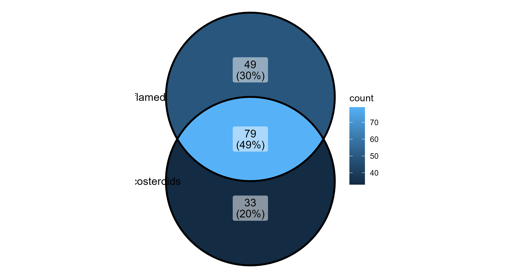
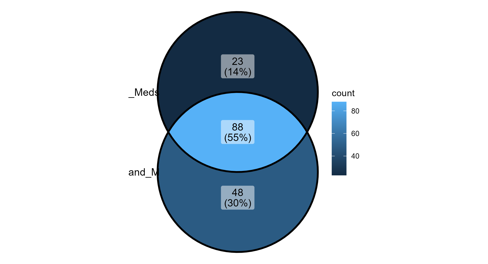
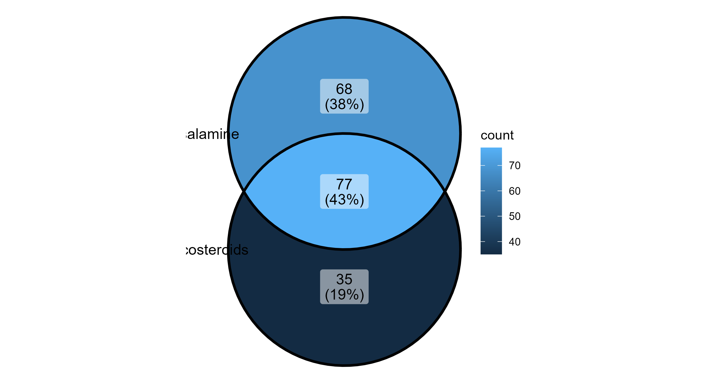
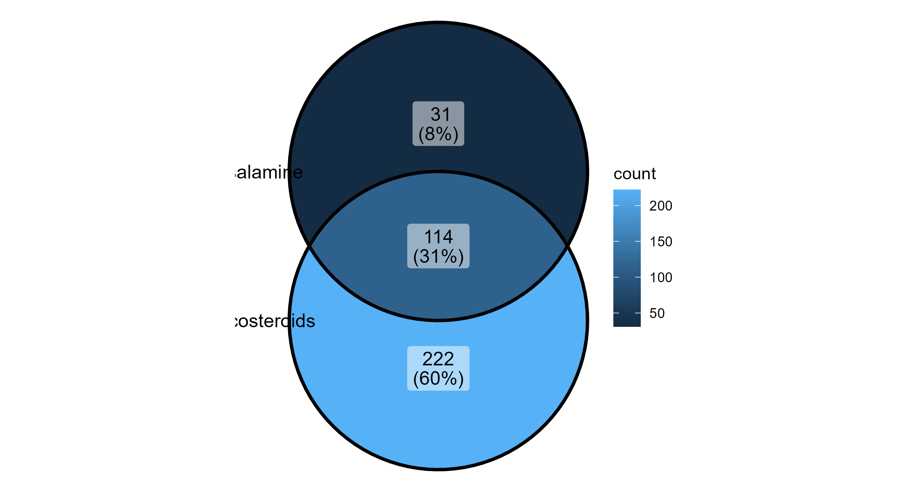
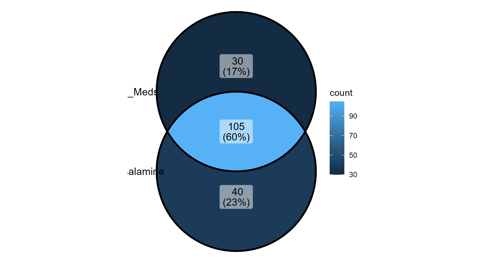
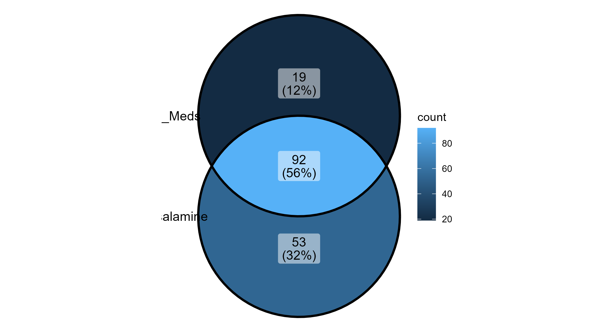

# Core Microbiome Analysis using phyloseq

# Contents:
# 1. Imports metadata, OTU/ASV table, taxonomy, and phylogenetic tree
# 2. Builds a phyloseq object
# 3. Converts counts to relative abundance
# 4. Subsets samples by histological status and medication groups
# 5. Identifies core ASVs for multiple group comparisons
# 6. Visualizes core taxa with bar plots and Venn diagrams


# Load required packages
```r
library(phyloseq)
library(ape)
library(tidyverse)
library(vegan)
library(picante)
library(microbiome)
library(ggplot2)
library(ggVennDiagram)
```
# Read in input data
```r
meta <- read_delim(file = "ryan_metadata.tsv")

otufp <- "exported-feature-table/feature-table.txt"
otu <- read_delim(file = otufp, delim = "\t", skip = 1)

taxfp <- "exported-taxonomy/taxonomy.tsv"
tax <- read_delim(taxfp, delim = "\t")

phylotreefp <- "exported-tree/tree.nwk"
phylotree <- read.tree(phylotreefp)
```

# Build OTU table
```r
otu_mat <- as.matrix(otu[, -1])
rownames(otu_mat) <- otu$`#OTU ID`
OTU <- otu_table(otu_mat, taxa_are_rows = TRUE)
```

# Build sample_data object

## Assumes the first column in metadata contains sample IDs
```r
samp_df <- as.data.frame(meta)
rownames(samp_df) <- samp_df[[1]]
samp_df <- samp_df[, -1]   # Remove sample ID column after setting row names
SAMP <- sample_data(samp_df)
```

# Build taxonomy table

## Split semicolon-delimited taxonomy string into standard ranks
```r
tax_mat <- tax %>%
  select(-Confidence) %>%
  separate(
    col = Taxon,
    sep = "; ",
    into = c("Domain", "Phylum", "Class", "Order", "Family", "Genus", "Species")
  ) %>%
  as.matrix()
```
# Remove feature ID column from taxonomy matrix, then set row names
```r
tax_mat <- tax_mat[, -1]
rownames(tax_mat) <- tax$`Feature ID`
TAX <- tax_table(tax_mat)
```

# Build phyloseq object
```r
ryan_phyloseq <- phyloseq(OTU, SAMP, TAX, phylotree)
```
# Save phyloseq object for reuse
```r
save(ryan_phyloseq, file = "ryan_phyloseq.RData")
```

# Convert OTU counts to relative abundance
```r
ryan_RA <- transform_sample_counts(ryan_phyloseq, fun = function(x) x / sum(x))
```

# Subset by histological status

## NOTE: These strings appear to include trailing spaces in the metadata.
```r
inflamed <- subset_samples(ryan_RA, Histological.status == "Inflamed tissue ")
noninflamed <- subset_samples(ryan_RA, Histological.status == "Noninflamed tissue ")
```

# Subset by treatment groups

## C alone = Corticosteroids only
```r
C_inflamed <- subset_samples(inflamed, Medications == "Corticosteroids")
C_noninflamed <- subset_samples(noninflamed, Medications == "Corticosteroids")
```
## M alone = Mesalamine only
```r
M_inflamed <- subset_samples(inflamed, Medications == "Mesalamine")
M_noninflamed <- subset_samples(noninflamed, Medications == "Mesalamine")
```
## C + M = Corticosteroids + Mesalamine
```r
C_M_inflamed <- subset_samples(
  inflamed,
  Medications %in% c("Mesalamine+corticosteroids", "corticosteroids+Mesalamine")
)

C_M_noninflamed <- subset_samples(
  noninflamed,
  Medications %in% c("Mesalamine+corticosteroids", "corticosteroids+Mesalamine")
)
```
## No medication
```r
No_inflamed <- subset_samples(inflamed, Medications == "No")
No_noninflamed <- subset_samples(noninflamed, Medications == "No")
```
## C + combination groups (multi-drug combinations including corticosteroids)
```r
C_Comb_inflamed <- subset_samples(
  inflamed,
  Medications %in% c(
    "Mesalamine+corticosteroids+mercaptopurine",
    "Mercaptopurine+corticosteroids"
  )
)

C_Comb_noninflamed <- subset_samples(
  noninflamed,
  Medications %in% c(
    "Mesalamine+corticosteroids+mercaptopurine",
    "Mercaptopurine+corticosteroids"
  )
)
```

## Optional: Merge phyloseq objects for direct comparisons
## (Defined here in case you want to use them later)


## C vs M
```r
C_vs_M_inflamed <- merge_phyloseq(C_inflamed, M_inflamed)
C_vs_M_noninflamed <- merge_phyloseq(C_noninflamed, M_noninflamed)
```
## M vs No
```r
M_vs_No_inflamed <- merge_phyloseq(M_inflamed, No_inflamed)
M_vs_No_noninflamed <- merge_phyloseq(M_noninflamed, No_noninflamed)
```
## C + M vs No
```r
C_M_vs_No_inflamed <- merge_phyloseq(C_M_inflamed, No_inflamed)
C_M_vs_No_noninflamed <- merge_phyloseq(C_M_noninflamed, No_noninflamed)
```
## C + combination vs No
```r
C_Comb_vs_No_inflamed <- merge_phyloseq(C_Comb_inflamed, No_inflamed)
C_Comb_vs_No_noninflamed <- merge_phyloseq(C_Comb_noninflamed, No_noninflamed)
```

## Check number of samples in key groups
```r
nsamples(C_inflamed)
nsamples(M_inflamed)
nsamples(C_M_inflamed)
nsamples(No_inflamed)
```

## Helper function for bar plots

# Replaces missing Genus values with fallback labels based on Family or Order
```r
plot_core <- function(physeq, group_name) {
  tax <- tax_table(physeq)
```
  # Replace NA Genus with "Unclassified_<Family>"
```r
  na_genus <- is.na(tax[, "Genus"])
  if (any(na_genus)) {
    tax[na_genus, "Genus"] <- paste0("Unclassified_", tax[na_genus, "Family"])
```
    # If Family is also NA, fall back to Order
    still_na <- is.na(tax[, "Genus"])
    if (any(still_na)) {
      tax[still_na, "Genus"] <- paste0("Unclassified_", tax[still_na, "Order"])
    }

    tax_table(physeq) <- tax
  }
```r
  plot_bar(physeq, fill = "Genus") +
    ggtitle(group_name) +
    facet_wrap(. ~ Medications, scales = "free") +
    theme(axis.text.x = element_text(angle = 90, hjust = 1))
}
```
# G1: Corticosteroids only vs All Inflamed / All Noninflamed


# Core ASVs at 70% prevalence
```r
C_inf_ASVs <- core_members(C_inflamed, detection = 0, prevalence = 0.7)
inf_ASVs <- core_members(inflamed, detection = 0, prevalence = 0.7)
C_noninf_ASVs <- core_members(C_noninflamed, detection = 0, prevalence = 0.7)
noninf_ASVs <- core_members(noninflamed, detection = 0, prevalence = 0.7)
```
# Inspect taxonomy of core ASVs
```r
prune_taxa(C_inf_ASVs, ryan_RA) %>% tax_table()
prune_taxa(inf_ASVs, ryan_RA) %>% tax_table()
prune_taxa(C_noninf_ASVs, ryan_RA) %>% tax_table()
prune_taxa(noninf_ASVs, ryan_RA) %>% tax_table()
```
# Plot relative abundance of core taxa
```r
plot_core(prune_taxa(C_inf_ASVs, C_inflamed), "G1: Corticosteroids - Inflamed")
plot_core(prune_taxa(inf_ASVs, inflamed), "G1: All Inflamed")
plot_core(prune_taxa(C_noninf_ASVs, C_noninflamed), "G1: Corticosteroids - Noninflamed")
plot_core(prune_taxa(noninf_ASVs, noninflamed), "G1: All Noninflamed")
```
# Venn diagrams (10% prevalence, 0.1% detection)
```r
G1_inf_list <- list(
  Corticosteroids = core_members(C_inflamed, detection = 0.001, prevalence = 0.10),
  Inflamed = core_members(inflamed, detection = 0.001, prevalence = 0.10)
)

G1_noninf_list <- list(
  Corticosteroids = core_members(C_noninflamed, detection = 0.001, prevalence = 0.10),
  Noninflamed = core_members(noninflamed, detection = 0.001, prevalence = 0.10)
)

G1_inf_venn <- ggVennDiagram(x = G1_inf_list)
G1_noninf_venn <- ggVennDiagram(x = G1_noninf_list)

ggsave("venn_G1_inflamed.png", G1_inf_venn)
ggsave("venn_G1_noninflamed.png", G1_noninf_venn)
```



# G2: Corticosteroids + Mesalamine vs No medication
```r
C_M_inf_ASVs <- core_members(C_M_inflamed, detection = 0, prevalence = 0.7)
C_M_noninf_ASVs <- core_members(C_M_noninflamed, detection = 0, prevalence = 0.7)
No_inf_ASVs <- core_members(No_inflamed, detection = 0, prevalence = 0.7)
No_noninf_ASVs <- core_members(No_noninflamed, detection = 0, prevalence = 0.7)
```
# Inspect taxonomy of core ASVs
```r
prune_taxa(C_M_inf_ASVs, ryan_RA) %>% tax_table()
prune_taxa(C_M_noninf_ASVs, ryan_RA) %>% tax_table()
prune_taxa(No_inf_ASVs, ryan_RA) %>% tax_table()
prune_taxa(No_noninf_ASVs, ryan_RA) %>% tax_table()
```
# Plot relative abundance of core taxa
```r
plot_core(prune_taxa(C_M_inf_ASVs, C_M_inflamed), "G2: C+M - Inflamed")
plot_core(prune_taxa(No_inf_ASVs, No_inflamed), "G2: No Meds - Inflamed")
plot_core(prune_taxa(C_M_noninf_ASVs, C_M_noninflamed), "G2: C+M - Noninflamed")
plot_core(prune_taxa(No_noninf_ASVs, No_noninflamed), "G2: No Meds - Noninflamed")
```
# Venn diagrams
```r
G2_inf_list <- list(
  C_and_M = core_members(C_M_inflamed, detection = 0.001, prevalence = 0.10),
  No_Meds = core_members(No_inflamed, detection = 0.001, prevalence = 0.10)
)

G2_noninf_list <- list(
  C_and_M = core_members(C_M_noninflamed, detection = 0.001, prevalence = 0.10),
  No_Meds = core_members(No_noninflamed, detection = 0.001, prevalence = 0.10)
)

G2_inf_venn <- ggVennDiagram(x = G2_inf_list)
G2_noninf_venn <- ggVennDiagram(x = G2_noninf_list)

ggsave("venn_G2_inflamed.png", G2_inf_venn)
ggsave("venn_G2_noninflamed.png", G2_noninf_venn)
```



# G3: Corticosteroid combinations vs No medication
```r

C_Comb_inf_ASVs <- core_members(C_Comb_inflamed, detection = 0, prevalence = 0.7)
C_Comb_noninf_ASVs <- core_members(C_Comb_noninflamed, detection = 0, prevalence = 0.7)
```
# Inspect taxonomy of core ASVs
```r
prune_taxa(C_Comb_inf_ASVs, ryan_RA) %>% tax_table()
prune_taxa(C_Comb_noninf_ASVs, ryan_RA) %>% tax_table()
```
# Plot relative abundance of core taxa
```r
plot_core(prune_taxa(C_Comb_inf_ASVs, C_Comb_inflamed), "G3: C Combo - Inflamed")
plot_core(prune_taxa(No_inf_ASVs, No_inflamed), "G3: No Meds - Inflamed")
plot_core(prune_taxa(C_Comb_noninf_ASVs, C_Comb_noninflamed), "G3: C Combo - Noninflamed")
plot_core(prune_taxa(No_noninf_ASVs, No_noninflamed), "G3: No Meds - Noninflamed")
```
# Venn diagrams
```r
G3_inf_list <- list(
  C_Combo = core_members(C_Comb_inflamed, detection = 0.001, prevalence = 0.10),
  No_Meds = core_members(No_inflamed, detection = 0.001, prevalence = 0.10)
)

G3_noninf_list <- list(
  C_Combo = core_members(C_Comb_noninflamed, detection = 0.001, prevalence = 0.10),
  No_Meds = core_members(No_noninflamed, detection = 0.001, prevalence = 0.10)
)

G3_inf_venn <- ggVennDiagram(x = G3_inf_list)
G3_noninf_venn <- ggVennDiagram(x = G3_noninf_list)

ggsave("venn_G3_inflamed.png", G3_inf_venn)
ggsave("venn_G3_noninflamed.png", G3_noninf_venn)
```


# G4: Corticosteroids only vs Mesalamine only
```r

M_inf_ASVs <- core_members(M_inflamed, detection = 0, prevalence = 0.7)
M_noninf_ASVs <- core_members(M_noninflamed, detection = 0, prevalence = 0.7)
```
# Inspect taxonomy of core ASVs
```r
prune_taxa(C_inf_ASVs, ryan_RA) %>% tax_table()
prune_taxa(M_inf_ASVs, ryan_RA) %>% tax_table()
prune_taxa(C_noninf_ASVs, ryan_RA) %>% tax_table()
prune_taxa(M_noninf_ASVs, ryan_RA) %>% tax_table()
```
# Plot relative abundance of core taxa
```r
plot_core(prune_taxa(C_inf_ASVs, C_inflamed), "G4: Corticosteroids - Inflamed")
plot_core(prune_taxa(M_inf_ASVs, M_inflamed), "G4: Mesalamine - Inflamed")
plot_core(prune_taxa(C_noninf_ASVs, C_noninflamed), "G4: Corticosteroids - Noninflamed")
plot_core(prune_taxa(M_noninf_ASVs, M_noninflamed), "G4: Mesalamine - Noninflamed")
```
# Venn diagrams
```r
G4_inf_list <- list(
  Corticosteroids = core_members(C_inflamed, detection = 0.001, prevalence = 0.10),
  Mesalamine = core_members(M_inflamed, detection = 0.001, prevalence = 0.10)
)

G4_noninf_list <- list(
  Corticosteroids = core_members(C_noninflamed, detection = 0.001, prevalence = 0.10),
  Mesalamine = core_members(M_noninflamed, detection = 0.001, prevalence = 0.10)
)

G4_inf_venn <- ggVennDiagram(x = G4_inf_list)
G4_noninf_venn <- ggVennDiagram(x = G4_noninf_list)

ggsave("venn_G4_inflamed.png", G4_inf_venn)
ggsave("venn_G4_noninflamed.png", G4_noninf_venn)
```




# G5: Mesalamine only vs No medication
# Inspect taxonomy of core ASVs
```r
prune_taxa(M_inf_ASVs, ryan_RA) %>% tax_table()
prune_taxa(No_inf_ASVs, ryan_RA) %>% tax_table()
prune_taxa(M_noninf_ASVs, ryan_RA) %>% tax_table()
prune_taxa(No_noninf_ASVs, ryan_RA) %>% tax_table()
```
# Plot relative abundance of core taxa
```r
plot_core(prune_taxa(M_inf_ASVs, M_inflamed), "G5: Mesalamine - Inflamed")
plot_core(prune_taxa(No_inf_ASVs, No_inflamed), "G5: No Meds - Inflamed")
plot_core(prune_taxa(M_noninf_ASVs, M_noninflamed), "G5: Mesalamine - Noninflamed")
plot_core(prune_taxa(No_noninf_ASVs, No_noninflamed), "G5: No Meds - Noninflamed")
```
# Venn diagrams
```r
G5_inf_list <- list(
  Mesalamine = core_members(M_inflamed, detection = 0.001, prevalence = 0.10),
  No_Meds = core_members(No_inflamed, detection = 0.001, prevalence = 0.10)
)

G5_noninf_list <- list(
  Mesalamine = core_members(M_noninflamed, detection = 0.001, prevalence = 0.10),
  No_Meds = core_members(No_noninflamed, detection = 0.001, prevalence = 0.10)
)

G5_inf_venn <- ggVennDiagram(x = G5_inf_list)
G5_noninf_venn <- ggVennDiagram(x = G5_noninf_list)

ggsave("venn_G5_inflamed.png", G5_inf_venn)
ggsave("venn_G5_noninflamed.png", G5_noninf_venn)
```



# G6: Corticosteroids only vs No medication ####

## Core ASVs at 70% prevalence (for taxonomy/bar plots)
## Note: C_inf_ASVs, C_noninf_ASVs, No_inf_ASVs, No_noninf_ASVs already computed above
```r
prune_taxa(C_inf_ASVs,    ryan_RA) %>% tax_table()
prune_taxa(No_inf_ASVs,   ryan_RA) %>% tax_table()
prune_taxa(C_noninf_ASVs, ryan_RA) %>% tax_table()
prune_taxa(No_noninf_ASVs, ryan_RA) %>% tax_table()
```
## Plot relative abundance
```r
plot_core(prune_taxa(C_inf_ASVs,    C_inflamed),    "G6: Corticosteroids - Inflamed")
plot_core(prune_taxa(No_inf_ASVs,   No_inflamed),   "G6: No Meds - Inflamed")
plot_core(prune_taxa(C_noninf_ASVs, C_noninflamed), "G6: Corticosteroids - Noninflamed")
plot_core(prune_taxa(No_noninf_ASVs, No_noninflamed), "G6: No Meds - Noninflamed")
```
## Venn diagrams
```r
G6_inf_list <- list(
  Corticosteroids = core_members(C_inflamed,  detection = 0.001, prevalence = 0.10),
  No_Meds         = core_members(No_inflamed, detection = 0.001, prevalence = 0.10)
)
G6_noninf_list <- list(
  Corticosteroids = core_members(C_noninflamed,  detection = 0.001, prevalence = 0.10),
  No_Meds         = core_members(No_noninflamed, detection = 0.001, prevalence = 0.10)
)

G6_inf_venn    <- ggVennDiagram(x = G6_inf_list)
G6_noninf_venn <- ggVennDiagram(x = G6_noninf_list)

ggsave("venn_G6_inflamed.png",    G6_inf_venn)
ggsave("venn_G6_noninflamed.png", G6_noninf_venn)

```
# G7: No Medication vs C only vs M only vs C+M — Inflamed & Noninflamed ####

## 4 way Venn diagram
```r
G7_inf_list <- list(
  No_Meds         = core_members(No_inflamed,     detection = 0.001, prevalence = 0.10),
  Corticosteroids = core_members(C_inflamed,      detection = 0.001, prevalence = 0.10),
  Mesalamine      = core_members(M_inflamed,      detection = 0.001, prevalence = 0.10),
  C_and_M         = core_members(C_M_inflamed,    detection = 0.001, prevalence = 0.10)
)

G7_noninf_list <- list(
  No_Meds         = core_members(No_noninflamed,  detection = 0.001, prevalence = 0.10),
  Corticosteroids = core_members(C_noninflamed,   detection = 0.001, prevalence = 0.10),
  Mesalamine      = core_members(M_noninflamed,   detection = 0.001, prevalence = 0.10),
  C_and_M         = core_members(C_M_noninflamed, detection = 0.001, prevalence = 0.10)
)

G7_inf_venn    <- ggVennDiagram(x = G7_inf_list) +
  ggtitle("G7: No Meds vs C vs M vs C+M — Inflamed")

G7_noninf_venn <- ggVennDiagram(x = G7_noninf_list) +
  ggtitle("G7: No Meds vs C vs M vs C+M — Noninflamed")

ggsave("venn_G7_inflamed.png",    G7_inf_venn,    width = 8, height = 7)
ggsave("venn_G7_noninflamed.png", G7_noninf_venn, width = 8, height = 7)
```


